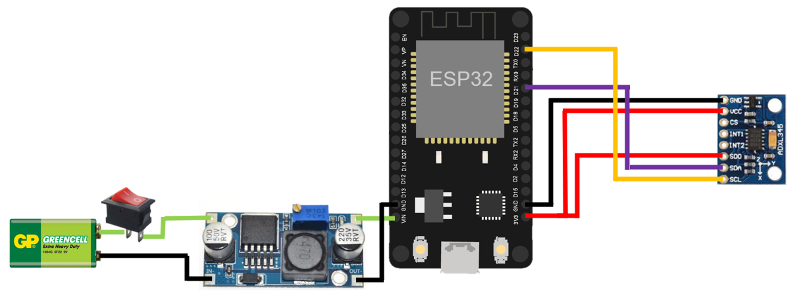

# FriutNinja_VR

Este es el proyecto final para nuestro curso de Sistemas Digitales II. El cual consiste en la construccion de un mando inalámbrico para el juego de Fruit Ninja en realidad aumentada
# Nombre del juego

[Fruit Ninja en VR]

## Propósito del juego

El propósito de este juego de realidad virtual (VR) es brindar a los jugadores una experiencia similar al popular juego para celulares móviles"Fruit Ninja". El jugador utilizará un dispositivo de captura en forma de una empuñadura de espada especial que, al moverla en el mundo real, el movimiento se traducirá en el entorno virtual del juego, donde el jugador podrá cortar frutas que aparecerán en el aire frente a él. La dinámica del juego se basa en la capacidad del jugador para reaccionar rápidamente, utilzar sus reflejos y realizar movimientos con la empuñadura de espada. 

## Instrucciones del juego

Al comenzar una partida del juego, se inicia un contador de un minuto y el jugador deberá cortar la mayor cantidad posible de frutas en ese tiempo. Cada vez que logra atinar y cortar una fruta con éxito, se obtienen puntos. El objetivo principal es superar la puntuación más alta obtenida anteriormente o competir con otros jugadores para alcanzar la mejor posición en el marcador.

1. Coloca y ajusta el casco de realidad virtual (VR).

2. Toma la empuñadura de espada firmemente en tu mano,

3. Una vez que estés listo, iniciará el juego al momento de mover la empuñadura luego de presionar el botón de alimentación en el dispositivo de control.

4. La partida comenzará y se mostrará un contador de un minuto en la interfaz

5. Mueve la empuñadura de espada en un solo eje para cortar las frutas que aparecen en el entorno virtual. Presta atención a la dirección de las frutas para lograr cortarlas.

6. Cada vez que cortes una fruta con éxito, obtendrás un punto. Intenta acumular la mayor cantidad de puntos posible antes de que se acabe el tiempo.

7. El juego terminará cuando el contador de un minuto llegue a cero. En ese momento, se mostrará tu puntuación final.

10. Si deseas volver a jugar, puedes reiniciar el juego presionando el botón de reinicio dentro del dispositivo de captura.

11. ¡Intenta superar tu puntuación más alta en cada intento y desafía a otros jugadores a superarte en el marcador!

## Descripción del mando

El mando utilizado en este juego de realidad virtual (VR) es una empuñadura de espada  diseñada para brindar una experiencia de corte de frutas inmersiva. El mando está construido con una cajita de madera que en su interior contiene elementos electróncios para capturar los movimientos del jugador y traducirlos al entorno virtual. Tiene un interruptor para encender el mando y además cuenta con una apertura en la que se encontrará el botón para reiniciar.

En el interior de la empuñadura de espada se encuentra una placa ESP32, que actúa como el cerebro del mando. La ESP32 es un microcontrolador que proporciona la capacidad de procesamiento necesaria para capturar y transmitir los datos de movimiento al juego.

Además, el mando está equipado con un acelerómetro ADXL345, un sensor que detecta los movimientos en el eje X. Este sensor permite que el juego registre y responda a los movimientos realizados por el jugador al mover la empuñadura de espada

## Créditos

Desarrollado por:
- [Andrea Carolina Soler Ramírez](andreac.solerr@uqvirtual.edu.co)
- [Álvaro Sebastián Hernández](alvaros.hernandezr@uqvirtual.edu.co)
- [Daniel Alejandro Cangrejo](daniela.cangrejol@uqvirtual.edu.co)
